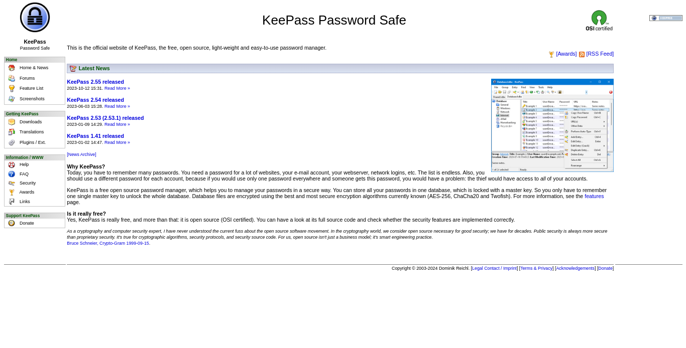

# KeePass Website Redesign

_This redesign is NOT officially from KeePass_

## What is KeePass?

[**KeePass**](https://keepass.info) is a free open source password manager, which helps you to manage your passwords in a secure way.

## Why Redesign The Website?

The main reason I wanted to redesign the KeePass website because I wanted to improve my design and front-end development skill.

Also, I don't think that the KeePass website is very optimal in terms of design; the fonts are small for both small and large screen sizes, and the texts are not very organized. And its not also optimized for mobile devices since the sizes of elements are just similar for both small and large screens.

## The Goals

- Make the KeePass website look good while still simple and close to their original design.
- Make the website responsive to different screen sizes
- Redesign the whole website and not only the homepage
-

## Design

### The Old/Original Design of KeePass Website

[**See KeePass Website**](https://keepass.info)

### The Redesign

[**Site Livepreview**](https://RealKendpr.github.io/keepass-website-redesign)

### Some more

First this is my original redesign of the menu, it will have a dropdown on it, for other links. But Im hesitant to do it yet, maybe next time.

So instead, I stick with the original design of their navigation bar, which is on the left-side, the one that looks like a sidebar.

##
